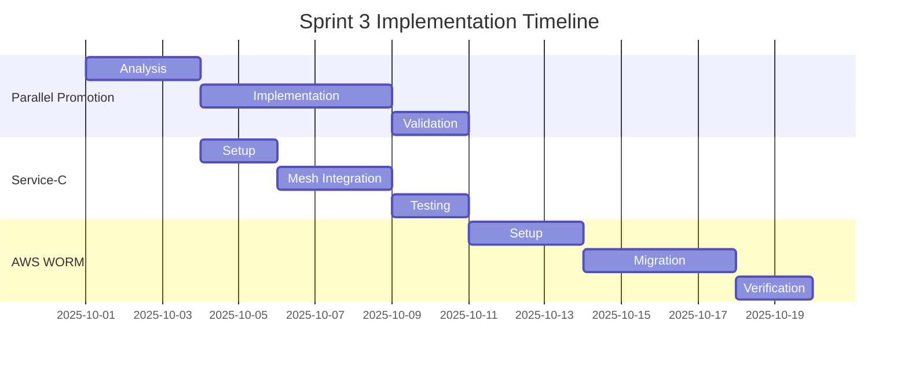

# Sprint 3 Preparation Plan
**Date**: September 25, 2025
**Status**: Planning
**Implementation**: 🚫 DO NOT IMPLEMENT YET

## 1. Parallel Promotion Migration

### 1.1 Current State
- Single service promotion only
- Sequential validation
- Local evidence storage

### 1.2 Migration Path
1. Infrastructure Requirements
   - Concurrent validation capability
   - Distributed locking mechanism
   - Transaction management

2. Implementation Phases
   ```mermaid
   graph TD
     A[Single Service] -->|Phase 1| B[Parallel Validation]
     B -->|Phase 2| C[Parallel Promotion]
     C -->|Phase 3| D[Full Parallel]
   ```

3. Rollback Strategy
   - Maintain single-service fallback
   - Version-specific rollback points
   - Evidence chain preservation

### 1.3 Success Criteria
- [ ] Multiple services promoted simultaneously
- [ ] Evidence chain maintains integrity
- [ ] No race conditions in validation
- [ ] Rollback capability preserved

## 2. Service-C Reactivation

### 2.1 Prerequisites
- ✅ Service-A mesh validation complete
- ✅ Service-B mesh validation complete
- ✅ Evidence chain proven stable

### 2.2 Implementation Plan
1. Mesh Integration
   - Apply learned patterns from A/B
   - Reuse validation scripts
   - Extend evidence chain

2. Dependencies
   - Service-A stable endpoints
   - Service-B stable endpoints
   - Updated RBAC policies

3. Validation Strategy
   ```mermaid
   graph LR
     A[Service-A] -->|Validate| C[Service-C]
     B[Service-B] -->|Validate| C
   ```

### 2.3 Success Criteria
- [ ] All mesh policies applied
- [ ] Inter-service communication validated
- [ ] Evidence chain updated
- [ ] Rollback tested

## 3. AWS Integration (WORM Storage)

### 3.1 Current State
- Local evidence storage
- File-based hashing
- Manual retention

### 3.2 AWS Migration
1. Infrastructure
   - S3 with Object Lock
   - KMS integration
   - IAM roles and policies

2. Implementation Phases
   ```mermaid
   graph TD
     A[Local Storage] -->|Phase 1| B[Dual Write]
     B -->|Phase 2| C[AWS Primary]
     C -->|Phase 3| D[Local Backup]
   ```

3. Components
   ```yaml
   storage:
     primary: AWS S3
     mode: WORM
     retention: 7 years
     backup: local-disk
     encryption: AWS-KMS
   ```

### 3.3 Success Criteria
- [ ] WORM compliance verified
- [ ] Retention policies enforced
- [ ] Access controls tested
- [ ] Backup strategy validated

## 4. Timeline Dependencies



## 5. Risk Assessment

### 5.1 Implementation Risks
1. Parallel Promotion
   - Impact: HIGH
   - Mitigation: Phased approach with rollback points

2. Service-C Integration
   - Impact: MEDIUM
   - Mitigation: Reuse validated patterns

3. AWS Migration
   - Impact: HIGH
   - Mitigation: Dual-write phase

### 5.2 Dependencies
1. Sprint 2 Completion
   - Status: In Progress
   - Blocker: No
   - Mitigation: Clear transition criteria

2. AWS Resources
   - Status: Not Started
   - Blocker: Yes
   - Mitigation: Early requisition

## 6. Preparation Checklist

### 6.1 Documentation
- [ ] Architecture diagrams updated
- [ ] Runbooks prepared
- [ ] Rollback procedures documented

### 6.2 Infrastructure
- [ ] AWS permissions requested
- [ ] S3 buckets planned
- [ ] KMS keys identified

### 6.3 Testing
- [ ] Test environments identified
- [ ] Validation scripts prepared
- [ ] Rollback scenarios documented

## 7. Notes

1. All implementation must wait for Sprint 2 completion
2. Keep all preparation document-only
3. Maintain clear dependency tracking
4. Update this plan as Sprint 2 progresses

---
Last Updated: September 25, 2025
Status: Ready for Review