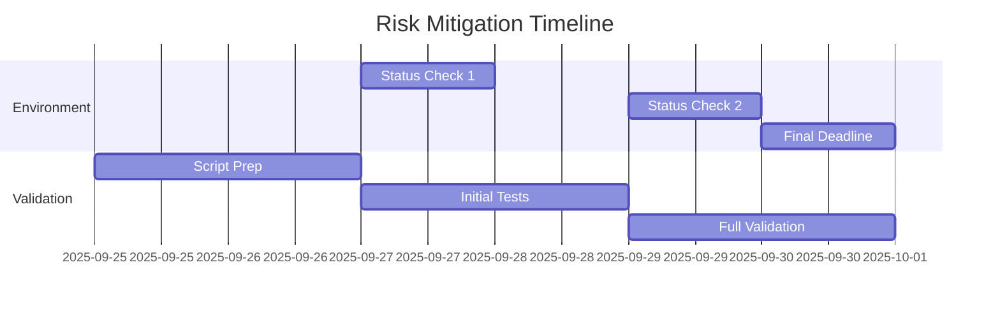

# Risk Assessment and Mitigation Plan
**Date**: September 25, 2025
**Sprint**: 2 (Mesh Implementation)
**Status**: Active

## 1. Critical Risk: Cluster Provisioning Delay

### 1.1 Timeline-Based Triggers

#### September 27, 2025 (T+2 days)
- **Status Check**: Cluster provisioning progress
- **Action Required If Delayed**:
  1. Initiate local development setup (Kind/Minikube)
  2. Update team on fallback plan activation
  3. Document deviation in evidence chain

#### September 29, 2025 (T+4 days)
- **Status Check**: Local development progress
- **Action Required If Issues**:
  1. Escalate to CTO
  2. Consider sprint timeline adjustment
  3. Document impact assessment

#### September 30, 2025 (T+5 days) - HARD DEADLINE
- **Status Check**: Final validation window
- **Required Action**:
  1. Must have either:
     - Production cluster ready
     - Local development environment validated
  2. Document final environment choice in evidence chain
  3. Begin mesh validation regardless of environment

### 1.2 Mitigation Strategies

#### Strategy 1: Local Development (Primary Fallback)
- Use Kind cluster with predefined configuration
- Implement with production-like resources
- Document deviations from production specs

#### Strategy 2: Reduced Scale Testing
- Minimum viable node count
- Core services only
- Document coverage limitations

#### Strategy 3: Parallel Preparation
- Prepare all validation scripts
- Document expected results
- Stage evidence collection

## 2. Dependent Risks

### 2.1 Validation Coverage
- **Impact**: MEDIUM
- **Trigger**: T+3 days without full environment
- **Mitigation**: 
  1. Define minimum viable validation set
  2. Prepare phased validation approach
  3. Document coverage decisions

### 2.2 Timeline Pressure
- **Impact**: HIGH
- **Trigger**: T+4 days without environment
- **Mitigation**:
  1. Identify critical path items
  2. Prepare acceleration options
  3. Document scope adjustments

## 3. Evidence Chain Implications

### 3.1 Documentation Requirements
- Record all environment decisions
- Document trigger points hit
- Maintain decision timestamps
- Include fallback justifications

### 3.2 Validation Evidence
- Separate evidence chains for:
  1. Production environment (if available)
  2. Local development environment
  3. Hybrid approach (if needed)

## 4. Communication Plan

### 4.1 Status Updates
- Daily environment status
- Trigger point notifications
- Mitigation activations
- Evidence chain updates

### 4.2 Escalation Path
1. Team Lead -> Development Manager
2. Development Manager -> CTO
3. CTO -> Stakeholders

## 5. Recovery Plan

### 5.1 Environment Recovery
- Document environment recreation steps
- Maintain configuration backups
- Version control all changes

### 5.2 Validation Recovery
- Checkpoint validation progress
- Store intermediate results
- Enable partial reruns

## 6. Success Criteria

### 6.1 Minimum Requirements
- [ ] Environment available (production or local)
- [ ] Core services deployed
- [ ] Basic mesh functionality verified
- [ ] Evidence chain maintained

### 6.2 Optional Enhancements
- [ ] Full production environment
- [ ] Complete service set
- [ ] Extended validation suite
- [ ] Performance metrics

## 7. Timeline Overview

---
Last Updated: September 25, 2025
Status: Active Monitoring